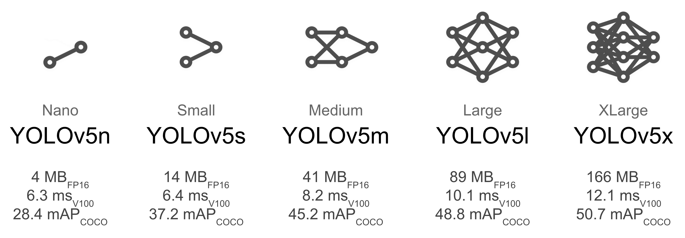

# IA para Detecção de Imagens

## Introdução

Para a detecção de imagens utilizando IA, estamos utilizando a biblioteca Python [YOLO Ultralytics](https://docs.ultralytics.com/models/yolov10/#comparisons). Embora a documentação esteja na versão 10, para este projeto utilizaremos a versão 8 (YOLOv8).

## Tipos de Modelos YOLO


No YOLO Ultralytics, existem diferentes tipos de modelos pré-treinados que podem ser utilizados para reconhecimento de objetos. Cada modelo varia em tamanho e precisão, como mostrado na imagem acima. O modelo padrão que recomendamos é o **YOLOv8n (Nano)**, mas vale a pena estudar qual modelo se adapta melhor às suas necessidades.

## Dataset

A estrutura do dataset consiste nas seguintes pastas e arquivos de configuração:

- **train**: Imagens utilizadas para treinamento (70% a 94% do total).
- **val**: Imagens utilizadas para validação (3% a 15% do total).
- **test** (opcional): Imagens para testar o modelo com novos casos (3% a 15% do total).
- **data.yaml**: Arquivo de configuração do dataset, que define os caminhos das pastas e as classes de objetos.

### Exemplo de Arquivo `data.yaml`

```yaml
# Ultralytics YOLO 🚀, AGPL-3.0 license
path: ../datasets/coco8 # diretório root do dataset
train: images/train # imagens de treinamento
val: images/val # imagens de validação
test: # imagens de teste (opcional)

# Classes
names:
  0: person
  1: bicycle
  2: car
  3: motorcycle
  4: airplane
  5: bus
  6: train
  7: truck
  8: boat
  9: traffic light
  10: fire hydrant
  11: stop sign
  12: parking meter
  13: bench
  14: bird
  15: cat
  16: dog
  17: horse
  18: sheep
  19: cow
  20: elephant
  21: bear
  22: zebra
  23: giraffe
  24: backpack
  25: umbrella
  26: handbag
  27: tie
  28: suitcase
  29: frisbee
  30: skis
  31: snowboard
  32: sports ball
  33: kite
  34: baseball bat
  35: baseball glove
  36: skateboard
  37: surfboard
  38: tennis racket
  39: bottle
  40: wine glass
  41: cup
  42: fork
  43: knife
  44: spoon
  45: bowl
  46: banana
  47: apple
  48: sandwich
  49: orange
  50: broccoli
  51: carrot
  52: hot dog
  53: pizza
  54: donut
  55: cake
  56: chair
  57: couch
  58: potted plant
  59: bed
  60: dining table
  61: toilet
  62: tv
  63: laptop
  64: mouse
  65: remote
  66: keyboard
  67: cell phone
  68: microwave
  69: oven
  70: toaster
  71: sink
  72: refrigerator
  73: book
  74: clock
  75: vase
  76: scissors
  77: teddy bear
  78: hair drier
  79: toothbrush

download: https://github.com/ultralytics/assets/releases/download/v0.0.0/coco8.zip
```

### Exemplo de Arquivo Label `000000000030.txt`
```txt
58 0.519219 0.451121 0.39825 0.75729
75 0.501188 0.592138 0.26 0.456192
```
### Imagem correspondente `000000000030.jpg`


Treinamento
O treinamento é bastante simples:

Importe o dataset para um Google Colab Notebook.
Baixe o modelo pré-treinado YOLOv8.
Instale as dependências necessárias (ultralytics).
Execute o comando de treinamento:

```
!yolo task=detect mode=train model=yolov8n.pt data={dataset.location}/data.yaml name=yolov8-1.25 epochs=25 imgsz=800 plots=True
```

Mais detalhes sobre a configuração do treinamento estão disponíveis na documentação do [Ultralytics](https://docs.ultralytics.com/usage/cfg/).

### Dicas para o Treinamento
Épocas: Representam o número de vezes que o modelo irá passar pelo dataset. O ideal é treinar a IA entre 600 e 1000 épocas para obter um bom desempenho.
Para mais detalhes sobre o passo a passo do treinamento, acesse [Ultralytics configuration](https://docs.ultralytics.com/usage/cfg/).

Para a realização do treinamento ele pode estar sendo feito nesse [Google Collab Notebook](https://colab.research.google.com/drive/1DaVplS3VBNj-nZo0f9qm1D-LokmpVyeT#scrollTo=FIQ_zeUGIp43): 

### Exportando o Modelo
Após o treinamento, o modelo pode ser exportado de .pt (PyTorch) para outros formatos, como NCNN para uso em Android, entre outros formatos necessários para compatibilidade ou desempenho.
